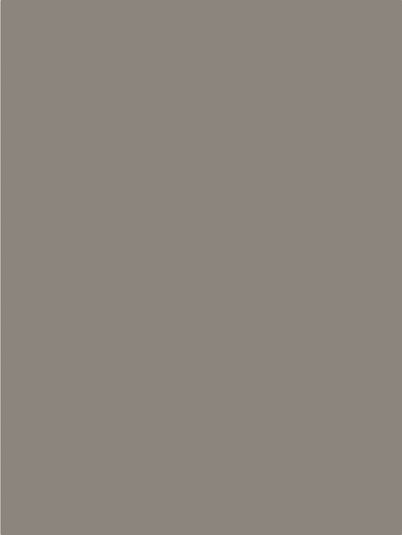

# painterly

**painterly** *(adjective)*: of a painting or its style, characterised by visible
brushwork and the rendering of form through colour and tone rather than by line.
This is a program that takes a photo and paints it that way, in your browser,
while you watch.

**Live:** [davemaynard.github.io/painterly](https://davemaynard.github.io/painterly/)

<p align="center">
  
</p>

A big brush lays in the underpainting. Finer brushes come back only where the
picture still disagrees with the photo. Every stroke runs along the image
instead of across it, so brushwork follows fur, edges and the line of a roof.
It finishes in 45 seconds at any size, then stops.

## What it does

- **Paints coarse to fine.** Five brushes, each half the size of the last. Each
  one blurs the photo to its own scale, measures where the canvas is still
  wrong, and puts a stroke down only there. The likeness *converges*; it
  doesn't fill in at random.
- **Strokes follow the picture.** Each step of a stroke moves perpendicular to
  the image gradient. That is the whole difference between brushwork and a
  smear filter.
- **Same photo, same seed, same painting.** All randomness is seeded, so a
  painting is reproducible on any machine, the timeline can be scrubbed to any
  moment, and the tests can compare pixels.
- **Time to done, not time in app.** The painting plays on a fixed 45-second
  clock, the underpainting fast and the finest brush slow, and then it is
  finished. There is a Download button and nothing else to do.
- **Or stop at the underpainting.** The *Underpainting* style plans the first,
  biggest brush only, with longer strokes and a looser threshold, and keeps
  the abstraction: a few hundred ribbons of colour that are unmistakably the
  photo and nothing like it. It was meant as a stage on the way to a painting
  and turned out to be the picture people liked.
- **Your own photo.** Drop in a file. It is painted in the tab and never
  uploaded anywhere.

## Numbers

| | |
|---|---|
| Library, gzipped | **6.4 KB** |
| Whole demo page script, gzipped | **6.7 KB** |
| Runtime dependencies | **0** (a Mersenne Twister is bundled, see `NOTICE`) |
| Planning a 1050 × 1400 photo | **~1.4 s** on an M4 Mac mini, ~106,000 strokes |

## Use it as a library

```sh
npm install github:davemaynard/painterly
```

```ts
import {brushes, createPainter, plan, rasterFromImageData} from 'painterly';

const context = canvas.getContext('2d');
context.drawImage(photo, 0, 0, canvas.width, canvas.height);
const source = rasterFromImageData(context.getImageData(0, 0, canvas.width, canvas.height));

// Pure data: every stroke, in painting order.
const painting = plan(source, {seed: 7});

// The hand: paints any prefix of the plan onto a 2D context.
const painter = createPainter(context, painting, brushes.bristle);
painter.paintTo(painting.strokes.length);
```

`plan()` takes options for the brush radii, the error threshold, stroke length
and curvature; the defaults are tuned for photos around 1400 px. `Plan` and
`Stroke` are plain typed objects, so a plan can be serialised, replayed, or
rendered by something other than the bundled painter.

## How it's built

- `src/image/` measures the photo: a float RGB raster, a linear-time Gaussian
  blur (three box blurs), luminance and a Sobel gradient. No canvas, no DOM.
- `src/plan/` decides the strokes, and names the two styles. Aaron Hertzmann's
  [*Painterly Rendering with Curved Brush Strokes of Multiple Sizes*](https://www.mrl.nyu.edu/publications/painterly98/)
  (SIGGRAPH 1998), ported and credited in the module header, with three habits
  kept from the 2020 sketches: a canvas primed with the photo's dominant hue
  family, a shuffled stroke order so the hand looks human, and seeded randomness.
- `src/paint/` is the hand: a `Brush` says how many bristles a stroke becomes,
  how translucent, how far each hair's colour and weight wander, and how ragged
  its start and finish are. `bristle` is the 2020 look, `ribbon` is this port's
  first brush and the underpainting's default, `round` is the pointillist sketch
  that never finished, `flat` is a house-painter's brush.
- `src/demo/` is the page: photo picker, a layer-paced schedule, a timeline
  that scrubs backwards from layer snapshots, and nothing else.
- `processing/` holds the 2020 Processing sketches this grew out of, untouched.

TypeScript, Canvas 2D, no framework. `tsup` builds the library to `dist/` and
the page script straight into `docs/`, which GitHub Pages serves as is; CI
rebuilds `docs/` and fails on a diff.

## Development

```sh
npm install
npm run check    # Biome and tsc
npm test         # the planner on synthetic images in Node, then the page in Chromium:
                 # determinism across loads, scrub-back equals paint-forward, phone width
npm run build
npm run gif      # re-record docs/demo.gif from the page (needs ffmpeg)
```

## Photos

The dog is mine. The others are from Unsplash, free to use under the
[Unsplash License](https://unsplash.com/license) and credited on the page:
[Jonny Gios](https://unsplash.com/photos/8mTgxXVpGGI),
[Cristina Anne Costello](https://unsplash.com/photos/7Jbx0dZyJkw),
[Pietro De Grandi](https://unsplash.com/photos/T7K4aEPoGGk). All are shipped
resized with their metadata stripped.

## License

MIT. The bundled Mersenne Twister is BSD-3-Clause; see `NOTICE`.
