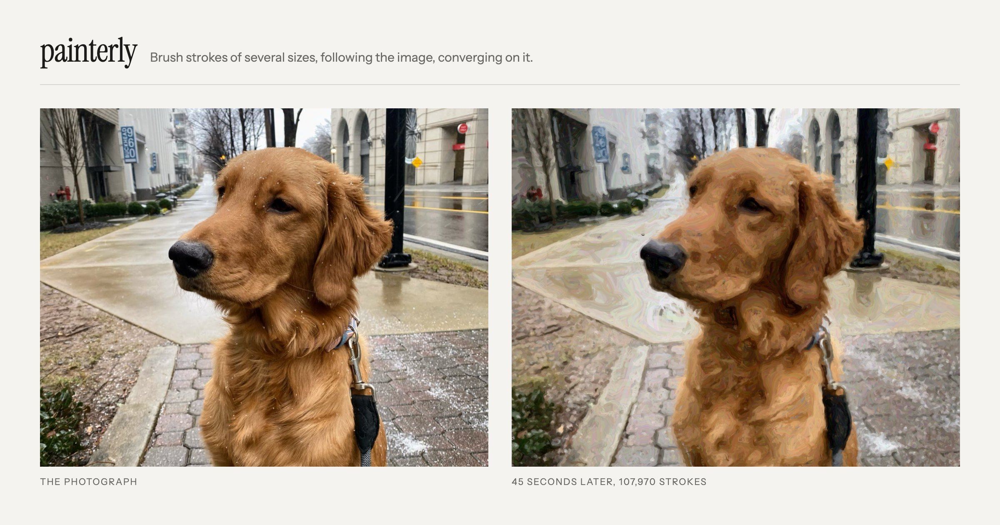
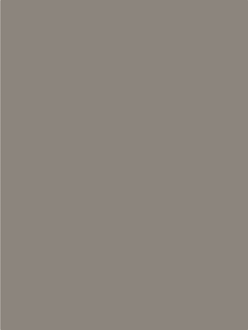
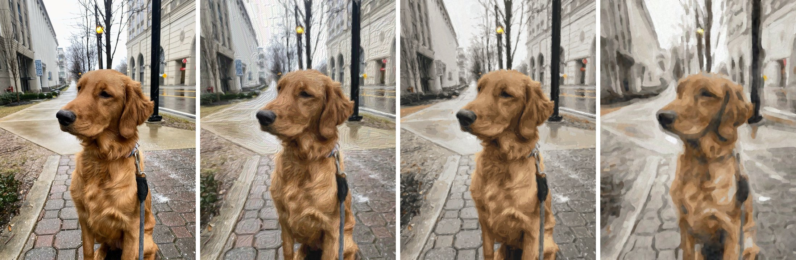
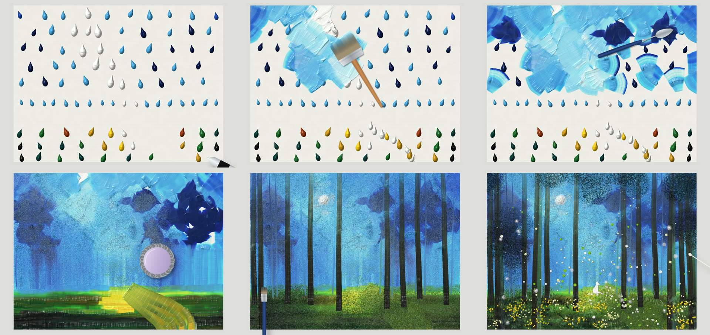

# painterly

**painterly** *(adjective)*: of a painting or its style, characterized by visible
brushwork and the rendering of form through color and tone rather than by line.
This is a program that takes a photo and paints it that way, in your browser,
while you watch.

**Live:** [davemaynard.github.io/painterly](https://davemaynard.github.io/painterly/)

<p align="center">
  
</p>

<p align="center">
  
</p>

A big brush lays in the underpainting. Finer brushes come back only where the
picture still disagrees with the photo. Every stroke runs along the image
instead of across it, so brushwork follows fur, edges and the line of a roof.
It finishes in 45 seconds at any size — 20 for the underpainting — then stops.

## What it does

- **Paints coarse to fine.** Five brushes, each half the size of the last. Each
  one blurs the photo to its own scale, measures where the canvas is still
  wrong, and puts a stroke down only there. The likeness *converges*; it
  doesn't fill in at random.
- **Strokes follow the picture.** Each step of a stroke moves perpendicular to
  the image gradient. That is the whole difference between brushwork and a
  smear filter.
- **Same photo, same seed, same painting.** All randomness is seeded, so a
  painting is reproducible on any machine, the timeline can be scrubbed to any
  moment, and the tests can compare pixels.
- **Time to done, not time in app.** The painting plays on a fixed 45-second
  clock, the underpainting fast and the finest brush slow, and then it is
  finished. There is a Download button and nothing else to do.
- **Or stop at the underpainting.** The *Underpainting* style plans the first,
  biggest brush only, with longer strokes and a looser threshold, and keeps
  the abstraction: a few hundred ribbons of color that are unmistakably the
  photo and nothing like it. It was meant as a stage on the way to a painting
  and turned out to be the picture people liked.
- **Your own photo.** Drop one on the picture, or pick a file. It is painted in
  the tab and never uploaded anywhere.
- **On a phone too.** The bench unfolds, the photo is planned smaller so the
  wait stays a couple of seconds, and the transport still clears the fold.

## Numbers

Run `npm run size` to regenerate the first three.

| | |
|---|---|
| Library, gzipped | **7.7 KB** |
| Demo page script and its worker, gzipped | **11.3 KB** |
| Studio page script, gzipped | **32.8 KB** |
| Runtime dependencies | **0** (a Mersenne Twister is bundled, see `NOTICE`) |
| Planning a 1050 × 1400 photo | **~1.2 s** on an M4 Mac mini, ~108,000 strokes |
| A plan crossing back from the worker | **15 MB** packed into typed arrays, not 110 MB of objects |
| Longest frame CI will accept | **60 ms** painting, **100 ms** skipping to the end |
| The studio's whole painting | **26,561** events in **4.2 s** of GPU time; plays at **60 fps** at 4× on an M4 Mac mini, no frame over 17 ms |

## Use it as a library

```sh
npm install github:davemaynard/painterly
```

```ts
import {brushes, createPainter, plan, rasterFromImageData} from 'painterly';

const context = canvas.getContext('2d');
if (!context) throw new Error('no 2d context');

context.drawImage(photo, 0, 0, canvas.width, canvas.height);
const source = rasterFromImageData(context.getImageData(0, 0, canvas.width, canvas.height));

// Pure data: every stroke, in painting order.
const painting = plan(source, {seed: 7});

// The hand: paints any prefix of the plan onto a 2D context.
const painter = createPainter(context, painting, brushes.bristle);
painter.paintTo(painting.strokes.length);
```

`plan()` takes options for the brush radii, the error threshold, stroke length
and curvature, and an `onLayer` callback that hears from it after each brush;
the defaults are tuned for photos around 1400 px. `flow: 'tensor'` trades the
1998 paper's swirls for calm: stroke directions are smoothed first, so a sky or
a lawn is laid in coherent runs that take their heading from the nearest real
edge. `Plan` and `Stroke` are plain
typed objects, so a plan can be serialized, replayed, or rendered by something
other than the bundled painter. `packPlan()` and `unpackPlan()` turn a plan into
a handful of typed arrays and back, exactly: the form to post from a worker or
keep around, at a seventh of the memory.

## Or from the command line

<p align="center">
  
</p>

`cli/` paints a photo on disk in one of three media and writes a JPEG, in a
few seconds at 1800 px. It is its own small package, so the library keeps no
runtime dependencies; it runs its TypeScript directly on Node 22.18 or later.

```sh
npm install                             # also builds the library the CLI paints with
(cd cli && npm install && npm link)     # puts `painterly` on your PATH

painterly photo.jpg                     # matte oil, to ~/Downloads/photo-oil.jpg
painterly photo.heic --style gouache --size 2400 --out painting.jpg --open
```

All three plan with `flow: 'tensor'` and paint with the same hand; a style is
the rest of the recipe, in `cli/src/styles.ts`.

- **Matte oil** refines down to a brush 1.5 px wide, so eyes and edges stay
  legible, with six stiff bristles that keep their marks. Its strokes are
  painted a second time as heights and lit from the upper left, diffuse only:
  a matte medium has no sheen, just the soft shadow of each ridge.
- **Gouache** plans from the photo reduced to 32 mixed colors (k-means in
  Oklab), so each area is one opaque color with a clean edge. An accent too
  small to earn a color of its own, a neon sign or a red collar, keeps its
  own.
- **Ink line and watercolor wash** lays translucent washes over a simplified,
  softened photo, lets the paper show through, darkens the edges where pigment
  pools, and draws pen lines only where the picture has a real shape edge
  (an extended difference of Gaussians, gated by a coarser gradient).

The canvas is cut into bands painted by one process each, which is what makes
it quick; the bands match a single canvas up to a few levels of antialiasing.
HEIC is read through macOS's `sips`.

## Or watch one painted with real tools

<p align="center">
  
</p>

[`studio/`](https://davemaynard.github.io/painterly/studio/) is a different kind of
painting: no photo, and no strokes planned from one. It follows an acrylic
painter's method step by step, the way a video tutorial teaches it, and
simulates every tool. Nineteen steps, about ten minutes at the hand's own
speed, and each tool is on screen doing its work.

- **Paint is pigment, not RGB.** Each tube is its color straight from the tube
  plus how hard it scatters light, and mixes the way pigment does
  (Kubelka-Munk): blue and yellow make green, a tenth of Prussian blue still
  turns white blue, black dirties everything it touches.
- **Paint goes both ways.** At every touch the tool and the canvas trade wet
  paint, and bristles carry some of it along with them. A dry two-inch brush
  picks up the drops it meets, drags them out into the stroke and lays them
  down further along, which is all smearing is.
- **Wet paint is two layers.** Fresh paint sits on what is there until a tool
  churns them together, so dark trunks pulled over a wet sky stay dark, streaked
  with the blue they dragged up.
- **One model per tool.** Bristles that clump and run dry, a knife that levels
  paint and leaves a ridge at its edge, steel wool that prints a new tangle of
  crinkled coils at every press and pulls the paint up into peaks, a comb whose
  teeth touch down and leave the canvas one at a time, cotton that drags fine
  rays when twisted, twenty swabs fanned out in a rubber band, a paint pen whose
  paint settles into an even film. Then a hair dryer, and the shine goes.
- **Lit like a photograph of a canvas.** Paint has thickness, the weave shows
  through thin paint, every ridge catches one light from the upper left, and
  wet paint shines.

The method is Jay Lee's, from his video
[Iron scrubber painting technique](https://youtu.be/96vWCTYhMZM). The picture, a
fox at the edge of a moonlit wood, is our own. It all runs on the GPU in
WebGL2, at 128 texels to the inch.

## How it's built

- `src/image/` measures the photo: a float RGB raster, a linear-time Gaussian
  blur (three box blurs), luminance, a Sobel gradient, and the same gradient
  smoothed through its structure tensor for calmer strokes. No canvas, no DOM.
- `src/plan/` decides the strokes, and names the two styles. Aaron Hertzmann's
  [*Painterly Rendering with Curved Brush Strokes of Multiple Sizes*](https://www.mrl.nyu.edu/publications/painterly98/)
  (SIGGRAPH 1998), ported and credited in the module header, with three habits
  kept from the 2020 sketches: a canvas primed with the photo's dominant hue
  family, a shuffled stroke order so the hand looks human, and seeded randomness.
- `src/paint/` is the hand: a `Brush` says how many bristles a stroke becomes,
  how translucent, how far each hair's color and weight wander, and how ragged
  its start and finish are. `bristle` is the 2020 look, `ribbon` is this port's
  first brush and the underpainting's default, `round` is the pointillist sketch
  that never finished, `flat` is a house-painter's brush.
- `src/demo/` is the page: photo picker, a layer-paced schedule, a player that
  paints under a per-frame budget and jumps between the brushes' stages from
  copies taken at the handovers, and a planner on its own thread that reports
  each brush as it goes and plans the other photos behind the one playing. The
  transport is a DVD player's rather than a scrubber on purpose: strokes go down
  over one another and cannot be lifted, so there is no playing backwards, and
  the moments worth returning to are where each brush begins. Back, play and on
  are three drawn glyphs, the same geometry as the carets on the selects; the
  stages beside them show where the painting has got to.
- `cli/` is the command line: the three media, the finishes that sit the paint
  on its support (relief, paper tooth, pigment pooling, ink), and the band
  painters.
- `src/studio/` is the studio page. `engine/` is the paint on the GPU: the
  pigments, the five textures a canvas is made of, a shader for each thing that
  can happen to it (a touch, a drop, drying) and one for the light.
  `tools.ts` gives each tool its size and habits, `score/` writes the painting
  down as gestures, `timeline.ts` puts the gestures on the clock, `player.ts`
  plays it with copies of the canvas kept for going back, and `sprites.ts` draws
  the tools from above, with the paint they actually carry on their tips.
- `processing/` holds the 2020 Processing sketches this grew out of, untouched.

TypeScript, Canvas 2D, no framework. `tsup` builds the library to `dist/` and
the page script and its worker straight into `docs/`, which GitHub Pages serves
as is; CI rebuilds `docs/` and fails on a diff.

## Development

```sh
npm install
npm run check    # Biome and tsc
npm test         # the planner on synthetic images in Node, then the page in Chromium:
                 # determinism across loads, scrub-back equals paint-forward, phone width
npm run build
npm run gif      # re-record docs/demo.gif from the page (needs ffmpeg)
npm run still    # re-shoot docs/still.jpg, the photo-and-painting pair above
npm run size     # re-measure the Numbers table
npm run studio:clip -- --speed 3 --out studio.mp4   # record the studio painting, start to finish (needs a GPU and ffmpeg)

npm install --prefix cli
npm run check --prefix cli    # tsc over the CLI (Biome covers it from the root)
npm test --prefix cli         # bands against one canvas, the palette, the noise, and each style end to end
npm run styles --prefix cli   # repaint docs/styles.jpg
```

## Photos

The dog is mine. The others are from Unsplash, free to use under the
[Unsplash License](https://unsplash.com/license) and credited on the page:
[Jonny Gios](https://unsplash.com/photos/8mTgxXVpGGI),
[Cristina Anne Costello](https://unsplash.com/photos/7Jbx0dZyJkw),
[Pietro De Grandi](https://unsplash.com/photos/T7K4aEPoGGk). All are shipped
resized with their metadata stripped.

## Who made it

[Dave Maynard](https://davemaynard.dev), a front-end engineer in Atlanta.
The dog is mine; everything else is credited below.

## License

MIT. The bundled Mersenne Twister is BSD-3-Clause; see `NOTICE`.
